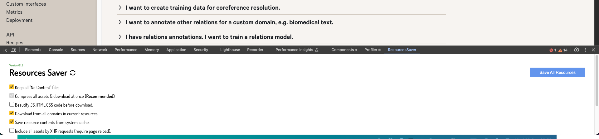

# Instructions

## Download Website resources

I installed ResourcesSaverExt: https://github.com/up209d/ResourcesSaverExt

I went to https://prodi.gy/docs/dependencies-relations

Right-click >`Inspect`. There should be a `ResourcesSaver` tab or something like this:



Hit `Save All Resources`.

To run the website you've downloaded, especially since it uses Next.js (as indicated by the `_next` directory), you'll need to set up a local web server to serve the static files properly. Here's how you can do it:

### **Step 1: Set Up a Local Web Server**

#### **Option A: Using Node.js and `http-server`**

1. **Install Node.js** (if not already installed):
   - Download and install Node.js from the [official website](https://nodejs.org/en/download/).

2. **Install `http-server` Globally**:
   ```bash
   npm install -g http-server
   ```

3. **Navigate to Your Project Directory**:
   ```bash
   cd path/to/your/project
   ```

4. **Start the Server**:
   ```bash
   http-server ./
   ```

5. **Access the Website**:
   - Open your browser and go to http://localhost:8080/docs/dependencies-relations.html. YOUR PORT MAY BE DIFFERENT.


### **Step 2: Configure Server for Next.js Routing (If Necessary)**

Next.js may use client-side routing, which requires all routes to be served through the `index.html`. If you encounter 404 errors when navigating, you'll need to set up rewrite rules.

#### **Using `http-server` with Proxy Options**

```bash
http-server . -P http://localhost:8080
```

#### **Using a Custom Server**

For more advanced setups, consider using a server like Express.js:

1. **Initialize a New Node.js Project**:
   ```bash
   npm init -y
   ```

2. **Install Express.js**:
   ```bash
   npm install express
   ```

3. **Create `server.js` File** with the Following Content:

   ```javascript
   const express = require('express');
   const path = require('path');
   const app = express();

   app.use(express.static(__dirname));

   app.get('*', (req, res) => {
     res.sendFile(path.resolve(__dirname, 'docs/dependencies-relations.html'));
   });

   const PORT = process.env.PORT || 3000;
   app.listen(PORT, () => {
     console.log(`Server is running on port ${PORT}`);
   });
   ```

4. **Run the Server**:
   ```bash
   node server.js
   ```

5. **Access the Website**:
   - Go to `http://localhost:3000` in your browser.

### **Step 3: Troubleshoot Common Issues**

- **Missing Environment Variables**: If the site was built with environment variables, some features might not work. Check the console for any errors.

- **Client-Side Rendering Dependencies**: Ensure all necessary assets are correctly linked and loaded.

- **CORS Issues**: If the site makes API calls, you might run into Cross-Origin Resource Sharing issues. You'll need to handle these in your server setup.

### **Additional Tips**

- **Use a Live Server Extension**: If you're using VSCode, the [Live Server extension](https://marketplace.visualstudio.com/items?itemName=ritwickdey.LiveServer) can quickly launch a local server.

- **Check for a `package.json`**: If available, you might be able to install dependencies and run scripts defined by the original project.

- **Static Export**: If the site was statically exported from Next.js (`next export`), serving the static files should suffice.
